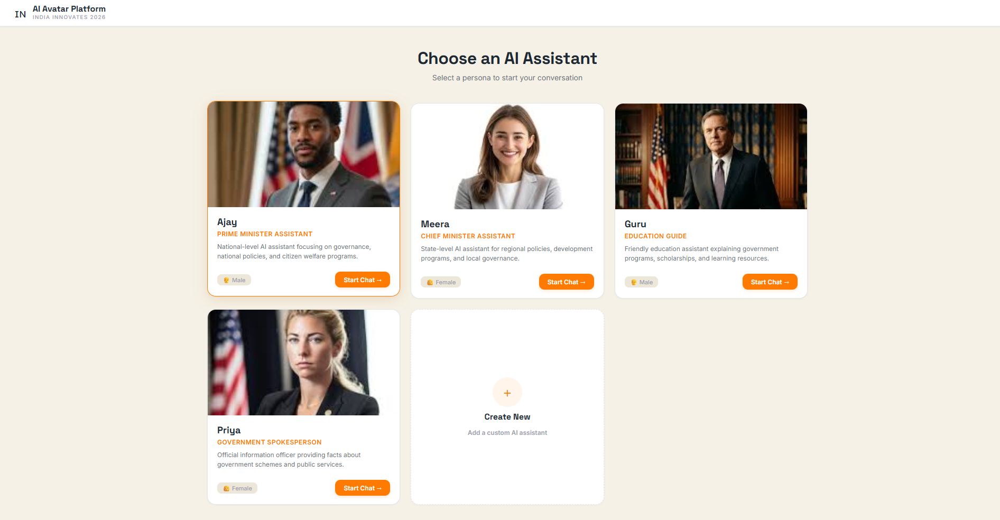
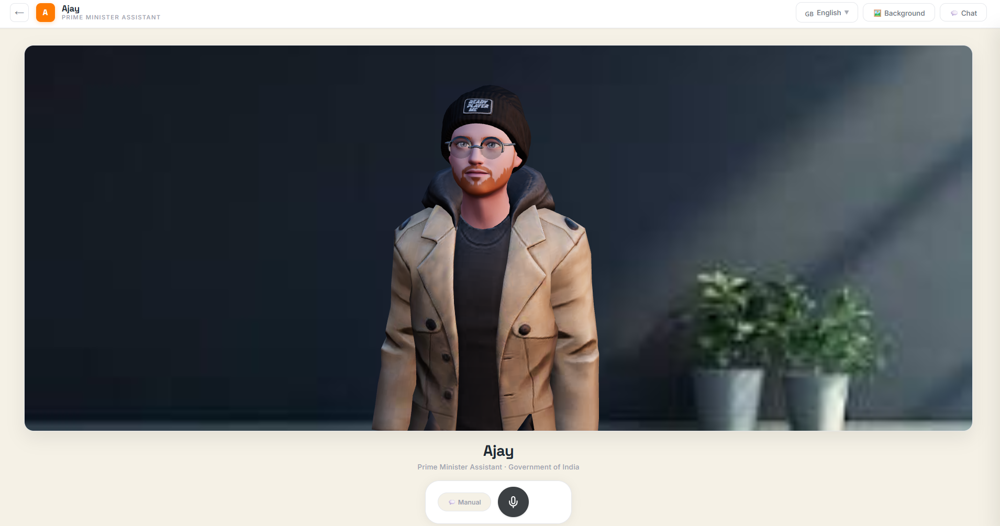
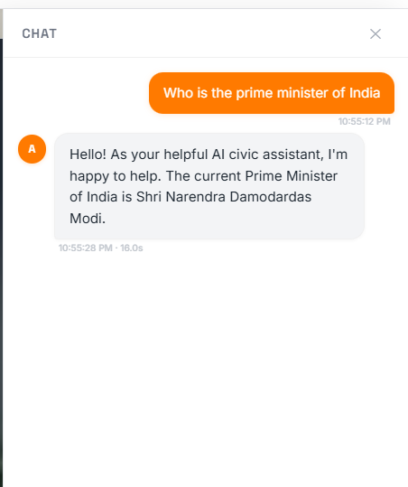

<p align="center">
  
  
  
</p>

# 🇮🇳 AI Avatar Civic Communication Platform

> **AI-powered multilingual avatar assistants for governance, education, and public outreach — running 100% locally with open-source models.**

An intelligent platform that helps Indian citizens understand government schemes, public services, and welfare programs through **interactive 3D avatar assistants** that can **see**, **hear**, **speak**, and **respond** in **6 Indian languages** — all without sending a single byte to the cloud.

---

## ✨ Key Features

- 🗣️ **Multilingual Voice Conversations** — Speak in English, Hindi, Marathi, Tamil, Telugu, or Bengali; the avatar responds in the same language
- 🧠 **Local AI Intelligence** — Powered by Meta Llama 3 via Ollama — no API keys, no cloud, no data leaks
- 🎭 **Multiple Avatar Personas** — Choose from 4 pre-built avatars, create your own, or load dynamic Avaturn GLB models
- 🎨 **High-Fidelity 3D Avatars** — GPU-accelerated React Three Fiber rendering with Avaturn API integration
- 👄 **Advanced Animation** — Viseme-based precise lip-sync, emotion-based expressions, and natural head orientation
- 🎤 **Full Speech Pipeline** — Voice Input → STT → Translation → LLM → Translation → TTS → Lip-Sync Animation
- 🖼️ **Virtual Backgrounds** — Google Meet-style backgrounds with custom upload support
- ⚡ **One-Command Setup** — Automated installer handles Node.js, Python, Ollama, and all dependencies
- 🔌 **Microservices Architecture** — Each AI capability is an independent service for fault isolation and scalability

---

## 📸 Screenshots

<p align="center">
  
  <br/><em>Avatar Selection — Choose from pre-built personas or create your own</em>
</p>

<p align="center">
  
  <br/><em>Video Call Interface — Real-time 3D avatar with lip-sync animation</em>
</p>

<p align="center">
  
  <br/><em>Chat Panel — Text-based interaction with pipeline timing</em>
</p>

<p align="center">
  
  <br/><em>Avatar Creator — Build custom avatars with unique personalities</em>
</p>

---

## 🎭 Avatar Personas

| Avatar | Name | Role | Focus Areas |
|--------|------|------|-------------|
| 🏛️ | **Ajay** | Prime Minister Assistant | National policies, flagship schemes (Digital India, Make in India, Swachh Bharat) |
| 🏢 | **Meera** | Chief Minister Assistant | State-level policies, regional development, local governance |
| 📚 | **Guru** | Education Guide | NEP 2020, scholarships, digital learning, Samagra Shiksha |
| 📢 | **Priya** | Government Spokesperson | Official information, citizen rights, public service navigation |
| ➕ | *Custom* | Create Your Own | Define name, personality, voice, and background |

---

## 🏗️ Architecture

```
┌─────────────────────────────────────────────────────────────┐
│                     Web Client (:5173)                      │
│   React + Vite │ 3D Avatar (Three.js) │ Mic │ Chat │ i18n  │
└──────────────────────────┬──────────────────────────────────┘
                           │ HTTP / WebSocket
┌──────────────────────────▼──────────────────────────────────┐
│                   Gateway API (:4000)                        │
│         Express.js — Pipeline Orchestration + WebSocket      │
└───┬──────┬──────┬──────┬──────┬─────────────────────────────┘
    │      │      │      │      │
┌───▼──┐ ┌─▼───┐ ┌▼───┐ ┌▼────┐ ┌▼──────┐
│ STT  │ │Trans│ │LLM │ │ TTS │ │Avatar │
│:5001 │ │:5002│ │:5003│ │:5004│ │:5005  │
│Whisper│ │Llama│ │Llama│ │Edge │ │WebGL  │
└──────┘ └─────┘ └─────┘ └─────┘ └───────┘
```

### Speech Pipeline Flow

```
🎤 Voice Input
    ↓
📝 Speech-to-Text (faster-whisper) + Language Detection
    ↓
🌐 Translation to English (Ollama/Llama3)
    ↓
🧠 LLM Response Generation (Llama3)
    ↓
🌐 Translation to Target Language
    ↓
🔊 Text-to-Speech (Edge-TTS) → Audio
    ↓
👤 3D Avatar Animation (Viseme Lip-Sync & Emotion Expressions)
```

---

## 🌍 Supported Languages

| Code | Language | Native Name | Voice Availability |
|------|----------|-------------|-------------------|
| `en` | English  | English     | ✅ Male & Female  |
| `hi` | Hindi    | हिन्दी      | ✅ Male & Female  |
| `mr` | Marathi  | मराठी       | ✅ Male & Female  |
| `ta` | Tamil    | தமிழ்      | ✅ Male & Female  |
| `te` | Telugu   | తెలుగు      | ✅ Male & Female  |
| `bn` | Bengali  | বাংলা       | ✅ Male & Female  |

---

## 🚀 Quick Start

### Prerequisites

| Software | Version | Download |
|----------|---------|----------|
| Node.js  | 18+     | [nodejs.org](https://nodejs.org) |
| Python   | 3.9+    | [python.org](https://python.org) |
| Ollama   | Latest  | [ollama.com](https://ollama.com) |

### Option 1: Automated Setup (Windows)

```bash
git clone https://github.com/<your-username>/ai-avatar-platform.git
cd ai-avatar-platform
scripts\setup.bat
```

The script will automatically:
- ✅ Detect or install Node.js, Python, and Ollama
- ✅ Pull the Llama3 model (~4.7 GB)
- ✅ Install all Node.js and Python dependencies

### Option 2: Manual Setup

```bash
# 1. Clone the repository
git clone https://github.com/<your-username>/ai-avatar-platform.git
cd ai-avatar-platform

# 2. Configure environment variables
cp .env.example .env

# 2. Install Ollama and pull llama3
ollama pull llama3

# 3. Install Node.js dependencies
cd services/translation-service && npm install && cd ../..
cd services/llm-service && npm install && cd ../..
cd services/avatar-service && npm install && cd ../..
cd backend/gateway-api && npm install && cd ../..
cd frontend/web-client && npm install && cd ../..

# 4. Install Python dependencies
cd services/stt-service && pip install -r requirements.txt && cd ../..
cd services/tts-service && pip install -r requirements.txt && cd ../..
```

### Start the Platform

```bash
node scripts/start-all.js
```

Open **http://localhost:5173** in your browser.

---

## 🛠️ Tech Stack

| Layer | Technology | Purpose |
|-------|-----------|---------|
| **Frontend** | React 18 + Vite 6 | Component-based UI with fast HMR dev server |
| **3D Rendering** | React Three Fiber + Avaturn | GPU-accelerated 3D avatars with dynamic GLB model loading |
| **Backend** | Node.js + Express 4 | REST API gateway and pipeline orchestration |
| **Real-time** | WebSocket (ws) | Live pipeline stage updates during response generation |
| **Speech-to-Text** | faster-whisper (Python) | CTranslate2-optimized Whisper for fast, accurate transcription |
| **LLM** | Ollama + Meta Llama 3 | Fully local LLM inference — zero cloud dependency |
| **Translation** | Ollama/Llama3 | LLM-powered multilingual translation (single model handles all languages) |
| **Text-to-Speech** | edge-tts + pyttsx3 | Neural TTS with offline fallback |
| **Animation** | Visemes & Morph Targets | Real-time viseme lip-sync and emotion-based expressions |
| **Voice Input** | Web Speech API | Browser-native speech recognition |
| **File Upload** | Multer | Handles audio file uploads for the STT pipeline |
| **Dev Tooling** | Leva | Real-time 3D scene parameter tuning |

---

## 📁 Project Structure

```
ai-avatar-platform/
├── frontend/
│   └── web-client/               # React + Vite UI
│       └── src/
│           ├── App.jsx            # Main app — video call interface
│           ├── avatarData.js      # Avatar personas & localStorage persistence
│           └── components/
│               ├── Scenario.jsx        # 3D scene setup (lighting, camera)
│               ├── Avatar3D.jsx        # 3D avatar model with lip-sync
│               ├── AvatarCanvas.jsx    # Canvas-based avatar (2D fallback)
│               ├── AvatarSelection.jsx # Avatar picker screen
│               ├── AvatarCreator.jsx   # Custom avatar creator modal
│               └── LanguageSelector.jsx # Language dropdown
├── backend/
│   └── gateway-api/
│       └── app.js                 # Express gateway — orchestrates full pipeline
├── services/
│   ├── stt-service/               # Speech-to-Text (Python + faster-whisper)
│   ├── translation-service/       # Translation (Node.js + Ollama)
│   ├── llm-service/               # LLM wrapper (Node.js + Ollama)
│   ├── tts-service/               # Text-to-Speech (Python + edge-tts)
│   └── avatar-service/            # Avatar metadata (Node.js)
├── config/
│   └── system-prompt.txt          # Default avatar personality prompt
├── scripts/
│   ├── start-all.js               # Multi-service launcher (7 services)
│   └── setup.bat                  # Windows automated setup
├── .env                           # Ports & model configuration
├── .gitignore
├── package.json
└── README.md
```

---

## 📡 API Reference

All endpoints are served through the **Gateway API** on port `4000`.

| Method | Endpoint | Description |
|--------|----------|-------------|
| `GET` | `/api/health` | Health check across all services |
| `POST` | `/api/pipeline` | **Full pipeline** — text → translate → LLM → translate → TTS → avatar |
| `POST` | `/api/speech-to-text` | Upload audio file → transcription + language detection |
| `POST` | `/api/translate` | Translate text between supported languages |
| `POST` | `/api/generate-response` | Get LLM response with conversation history |
| `POST` | `/api/text-to-speech` | Convert text to speech audio |
| `POST` | `/api/generate-avatar-video` | Get avatar rendering metadata |
| `GET` | `/api/audio/:fileId` | Audio file proxy (solves CORS for playback) |
| `GET` | `/api/demo` | Demo query about Digital India |
| `WS` | `/ws` | Real-time WebSocket for live interaction |

---

## 🎮 Services

| Service | Port | Runtime | Technology | Description |
|---------|------|---------|-----------|-------------|
| **STT** | 5001 | Python | faster-whisper | Speech-to-text + automatic language detection |
| **Translation** | 5002 | Node.js | Ollama/Llama3 | Multilingual translation across 6 languages |
| **LLM** | 5003 | Node.js | Ollama/Llama3 | Governance-focused AI response generation |
| **TTS** | 5004 | Python | edge-tts | High-quality neural multilingual speech synthesis |
| **Avatar** | 5005 | Node.js | Express | Avatar rendering metadata and configuration |
| **Gateway** | 4000 | Node.js | Express + WebSocket | Central pipeline orchestrator |
| **Frontend** | 5173 | Node.js | React + Vite | Interactive web client |

---

## 🧪 Demo

1. Start the platform:
   ```bash
   node scripts/start-all.js
   ```
2. Open **http://localhost:5173**
3. Select an avatar (e.g., **Ajay**)
4. Try these prompts:

   | Prompt | Language |
   |--------|----------|
   | "What is Digital India?" | English |
   | "Explain Ayushman Bharat scheme" | English |
   | "PM Kisan ke baare mein batao" | Hindi |
   | "Swachh Bharat Mission patti enna?" | Tamil |

5. Click the 🎤 mic button to use voice input
6. Toggle **Auto mode** for continuous conversation

---

## ⚙️ Configuration

Configuration is managed through the `.env` file:

```env
# Service Ports
GATEWAY_PORT=4000
STT_PORT=5001
TRANSLATE_PORT=5002
LLM_PORT=5003
TTS_PORT=5004
AVATAR_PORT=5005
FRONTEND_PORT=5173

# AI Models
OLLAMA_URL=http://localhost:11434
OLLAMA_MODEL=llama3               # Change to llama3:70b for higher quality
WHISPER_MODEL=small               # Options: tiny, base, small, medium, large

# Default Language
DEFAULT_LANGUAGE=en
```

---

## 🔒 Privacy & Security

- **100% Offline** — All AI models run locally on your machine
- **No API Keys** — Zero external service dependencies
- **No Data Exfiltration** — Voice, text, and personal data never leave your device
- **Open Source** — Full transparency; audit every line of code

---


<p align="center">
  <b>Built with ❤️ for India Innovates 2026 — Civic Technology Hackathon</b>
  <br/>
  <sub>Empowering citizens through accessible, AI-driven governance communication</sub>
</p>
